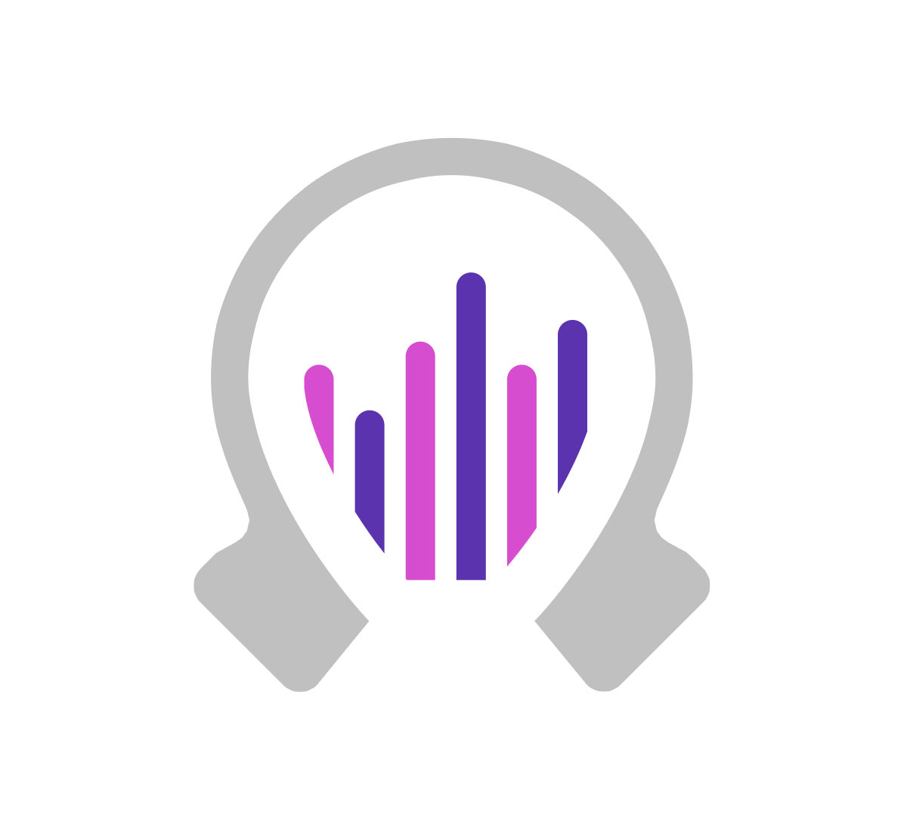
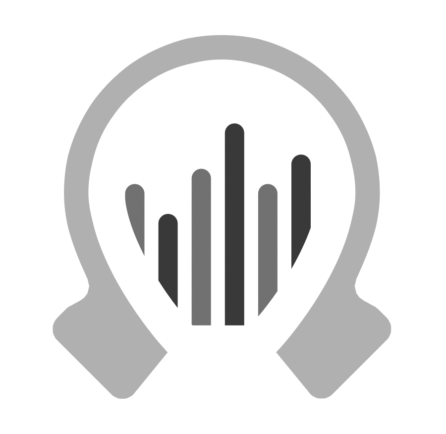
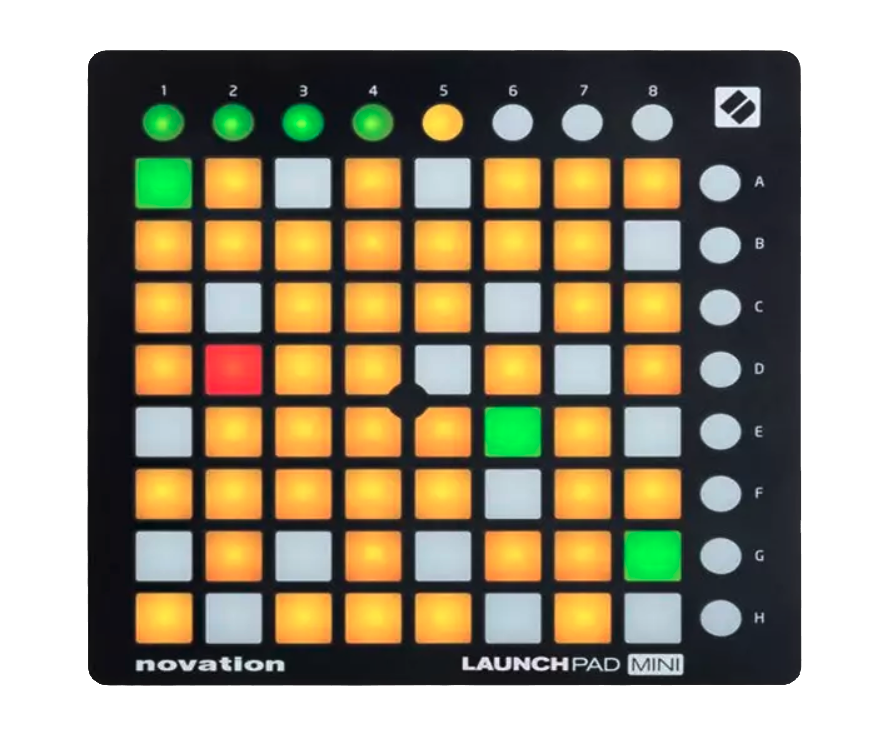
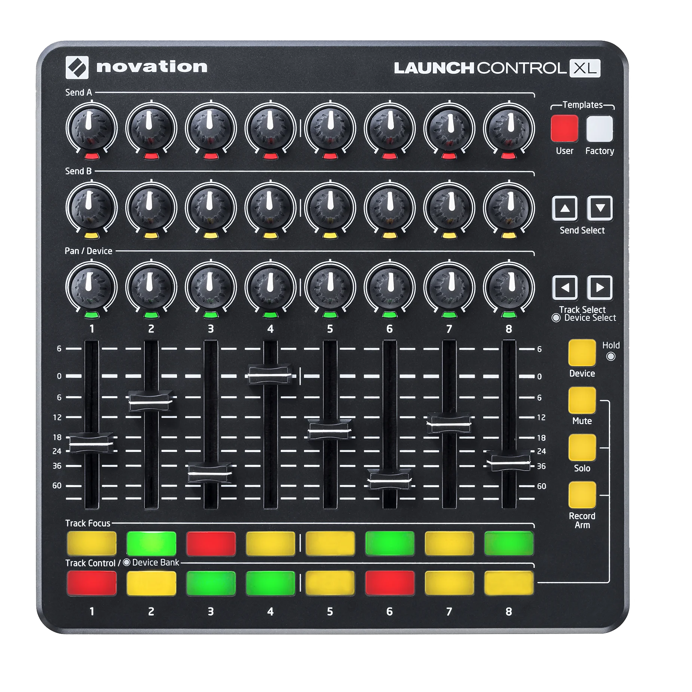

# Assets for Obscene Studio

### Resources

- [website](https://obscene.studio)

- [branding guidelines (PDF)](brandkit/obscene-studio-brand.pdf)

- [explainer PDF](documents/obscene-presentation.pdf)
   - Note: As I am not a native english speaker everything in the docs will sound like ... i am not a native english speaker.
     If you pick texts feel free to rephrase them the american way :)

### Logos

- [color](assets/logo-color-1024.png)
    

- [bw](assets/logo-bw.png)
    

- [horizontal transparent](brandkit/horizontal-text/trans-horizontal-big.png)
- [horizontal white](brandkit/horizontal-text/white-horizontal-big.png)
- [horizontal black](brandkit/horizontal-text/black-horizontal-big.png)
    

- [vertical transparent](brandkit/vertical-text/trans-vertical.png)
- [vertical white](brandkit/vertical-text/white-vertical.png)
- [vertical black](brandkit/vertical-text/black-vertical.png)
    

### MIDI devices

These are the devices used with Obscene Studio

- [novation launchpad mini](assets/novation-launchpad-mini.png)
    

- [novation launchcontrol xl](assets/novation-launchcontrol-xl-3.png)
    

### Third party integrations

Obscene Studio is integrated with GIPHY and Unsplash. Not neccessary to include in big size, but provided just in case they may fit as a small decoration.

- search & use photos from photographers all over the world (Unsplash), Should say "powered by" if used
    

- use the coolest animated stickers (Giphy)
    

### Demo Videos

More TBA

- [demo video 1](https://obscene.studio/platform/files/obscene-demo-1.mp4)

